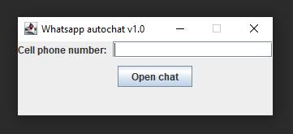
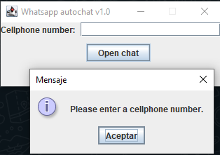
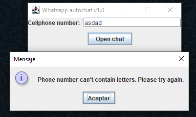
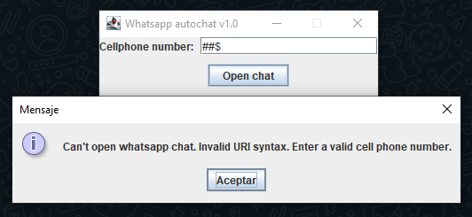
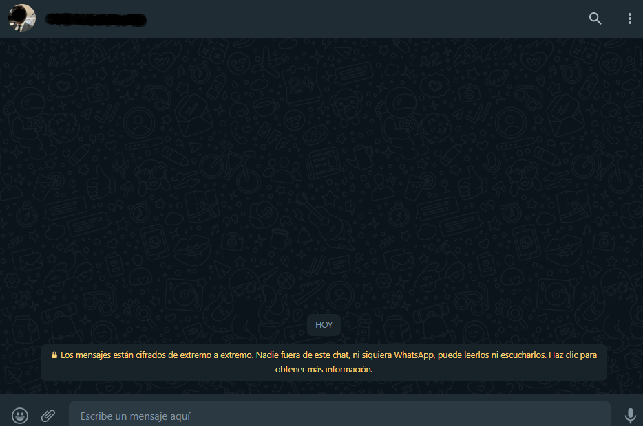

# whatsapp_autochat
WhatsApp Auto Chat is an application that allows you to automatically open a WhatsApp Web chat by entering the cellphone number, using the MVC design pattern.

Structure of the application:

Cell phone number field is null:

Cell phone number field can't contain letters:

Invalid cell phone number:

The entered phone number passes validation:

